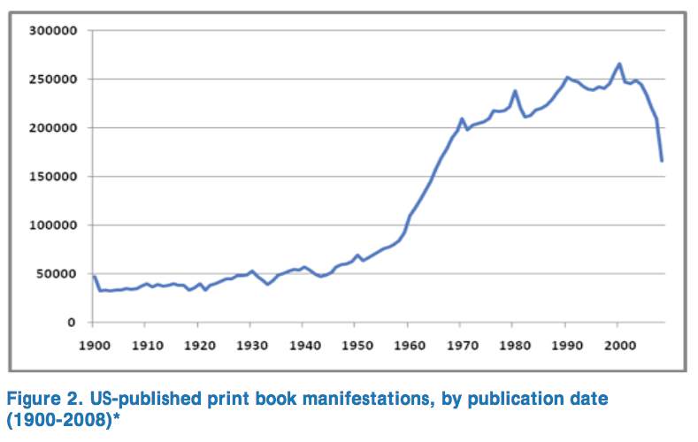
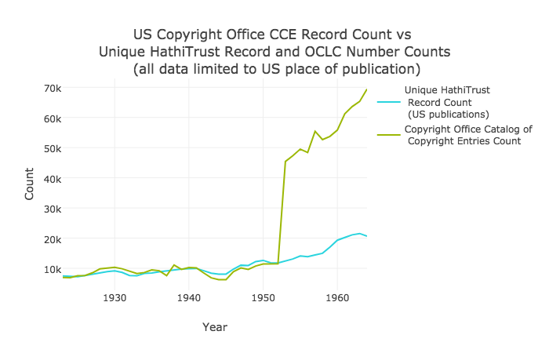
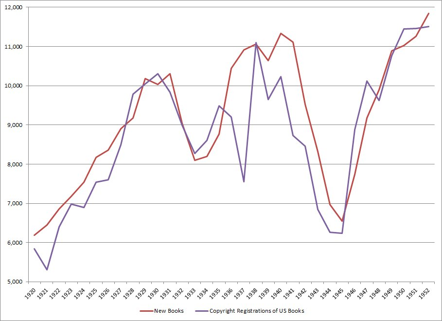

# How Many Books Were Published in the United States between 1923 and 1963?

Seems like it should be a pretty straightforward question, no?

Of course, anything touching bibliographic data is never so simple. 

One answer comes from a paper (and later book chapter) that I find myself returning to every few months: [Beyond 1923: Characteristics of Potentially In-copyright Print Books in Library Collections](http://www.dlib.org/dlib/november09/lavoie/11lavoie.html), by Brian Lavoie and Lorcan Dempsey, both of OCLC at the time of that paper's publication.[^chapter]

That curve tells us that US publications already topped 50,000 volumes in a year in 1930, and rose over 100,000 publications per year in 1960.

Given that WorldCat is likely the closest extant thing to a union catalog of the world's libraries, this is probably the most "definitive" view of US publications.[^worldcat_note] 

But for a particularly interesting time period -- 1923-1963 -- there are some other data sources we can query to see how they track with that OCLC data. If your pulse just perceptibly jumped at the sight of that date range, congratulations, you are a copyright nerd. For those uninitiated, there are many public domain materials in the period between 1923 and 1963, because for works published in the United States, copyright owners had to publish the works with a formal copyright notice, and also had to renew that copyright in order for it to remain in effect. If the copyright owner failed to do either of those two things, the work graduates to the public domain and becomes part of the open cultural record.

For this reason, libraries in general are very interested in materials published during that period; the [HathiTrust Digital Library](http://hathitrust.org/), as a library community partnership where dozens of institutions store digitized copies of more than 16 million works, is perhaps has the most to gain from careful review of works in this period -- if a work is reviewed and found to have no notice, for example, that work can be opened up for anyone to see online. HathiTrust has administered an amazing project known as the [Copyright Review Management System](https://www.hathitrust.org/copyright-review), which initially reviewed works published in the US between 1923 and 1963, and to date about 54.8% of the 366,202 volumes reviewed have been found to be in the public domain.[^wilkin_note] 

So HathiTrust has one set of data, comprising some 16 million digitized works. For my purposes here, I limited the HathiTrust bibliographic corpus to include only volumes known to be published in the United States between 1923 and 1963.[^sql] That's the curve in the above figure, in blue. (See [a larger and interactive version of this figure on Github](https://hadro.github.io/hathi_analysis/cce/cce_count.html))

Meanwhile, the United States Copyright Office, as part of the Library of Congress, has served as the central clearinghouse for copyright designations and registrations, which were required until 1977. When registration of copyright was required, the Copyright Office compiled all of these submissions into an annual "Catalog of Copyright Entries," which is a treasure trove of pointers to original copyright registration filings.

One useful thing the volumes do is indicate how many catalog entries are contained for that year. As a result, we can plot a curve of annual copyright registrations as published by the Copyright Office. That's the green curve in the above figure.

A few notable elements we can see from plotting those two curves:

1. The jump in Copyright Office catalog entries in 1953 stems from the fact that the Copyright office stopped counting monographs, serials, and pamphlets separately (to me, this seems like an odd change to make, but I'm sure they had reasons for this).
2. Prior to 1953, the Copyright Office data and the HathiTrust record data are quite strongly correlated. It seems completely reasonable to assume that correlation carries beyond 1953, but unless someone knows how to isolate monograph volumes 
3. The main deviation comes in 1937/1938, but my colleague's operating theory here is that the Copyright Office fell behind in registering works in 1937, but caught up in 1938 and kept an even pace from then until 1956/1957
4. Both curves show a demonstrable drop during World War II, which is also noticeable on the Lavoie/Dempsey figure above.
5. 

## Takeaways

So what have we learned?

1. WorldCat knows about roughly 5x as many books published in the United States between 1923 and 1963 than does HathiTrust. Interesting for HathiTrust partners to think about how to close that gap, which seems like a high ROI period of publications to look at.
1. HathiTrust (and WorldCat) know about many more volumes than were recorded by the US Copyright Office, and subsequently by Bowker. A couple thoughts on this: to me, this means that there are probably relatively few works that were officially registered with the Copyright Office that are missing from HathiTrust. Not none, but on balance, I believe it's probably correct to assume that those works are more likely to be widely held, particularly by the research libraries that comprise HathiTrust. This is great news, and really highlights the critical value of the CRMS project. Likewise, as a corollary, if you buy the previous assumption, then this seems like an even more important area for libraries to focus on filling out, since at the very least, it appears that 50% of the works published in this timeframe have been found to be in the public domain, and possibly higher, if you believe that the works likely to be missing are the ones that never registered for US copyright in the first place.
2. 

[^chapter]: Published as a chapter in a December 2013 OCLC report, [Understanding the Collective Collection: Towards a System-wide Perspective on Library Print Collections](https://www.oclc.org/content/dam/research/publications/library/2013/2013-09.pdf)

[^worldcat_note]: Of course, the data in WorldCat and other sources is only as good as our record keeping, and in this case that means catalogers correctly recording the [MARC 260 field for languages](http://www.loc.gov/marc/bibliographic/bd260.html) and that data making it from system to system with perfect fidelity. The main thing I'd be worried about is some number of items that either have not been cataloged or were cataloged with a indefinite or incorrect place of publication, but for my purposes here I believe the data libraries have been recording is as good as it can be.

[^wilkin_note]: Meanwhile, only 15% were found to be conclusively in-copyright, while the remaining 35%, or roughly 105,000 works, remain in a kind of copyright limbo. For more on CRMS see John Wilkin's fascinating article, [How Large Is the "Public Domain"? A Comparative Analysis of Ringer's 1961 Copyright Renewal Study and HathiTrust CRMS Data](http://crl.acrl.org/index.php/crl/article/view/16582)

[^sql]: The postgres sql query I used on my local version of [the Hathi files](https://www.hathitrust.org/hathifiles): `select publication_date, count(id), count(distinct(oclc_numbers)), count(distinct(hathitrust_record_number)) from hathifiles where publication_place like '__u' and publication_date > 1922 and publication_date < 1965 group by publication_date`