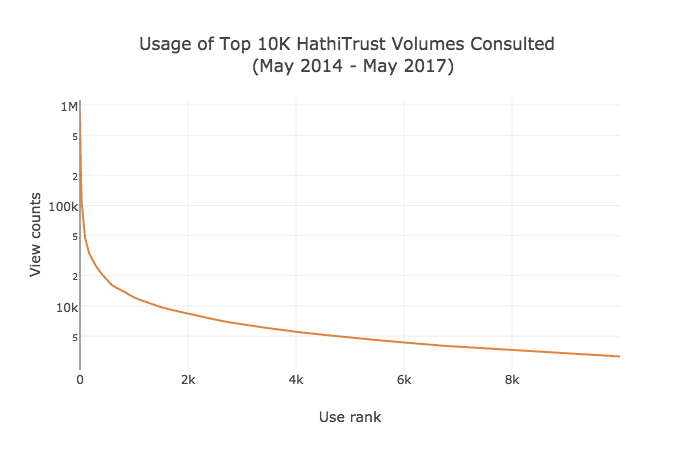
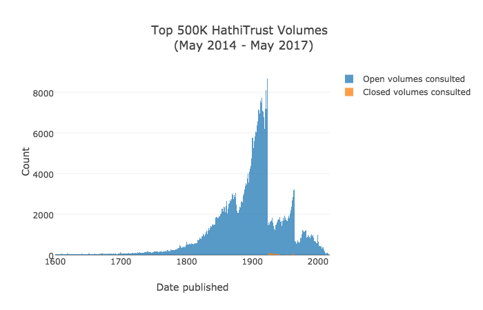

# HathiTrust Usage Analysis

As part of some work to expand the SimplyE project to include more materials
useful to the research community, I've done some basic analysis of HathiTrust
usage.

The data below covers the period May 8, 2014 - May 7, 2017.

## Headline numbers

**15,095,384** retrievable records from the Hathifiles (Pandas choked on a very, very
small subset of records which are not included here)

**3,247,601** distinct HathiTrust volume IDs consulted over three years

Most viewed title:

| Title |  Uses | Publication Date|
|-------|-------|-----------------|
|Quicksand, | 823739 views | 1928|
|The surnames of Scotland, their origin meaning and history / | 619250 views | 1962|
|Solid mensuration, | 452809 views | 1934|
|The human figure / | 348795 views | 1907|
|America is in the heart, a personal history, | 326990 views | 1946|
|Godey's magazine. | 311573 views | 1850|
|Roster of the Confederate soldiers of Georgia, 1861-1865 / | 285162 views | 9999|

See [top_open_items.txt](txt/top_open_items.txt) for the full list

Most viewed NYPL title: 

|Title |  Uses | Publication Date|
|------|-------|-----------------|
|Miranda / | 48465 views | 1915|
|Wife no. 19, or the story of a life in bondage : being a complete exposé of Mormonism, and revealing the sorrows, sacrifices and sufferings of women in polygamy / | 36158 views | 1875|
|Men of West Virginia ... | 30308 views | 1903|
|Illustrated trade catalogue and price list : manufacturers, importers and jobbers of watchmakers', jewelers' and engravers' supplies of every description : optical goods, chains, charms, etc. : originators of the box matetial [sic] and makers of Swartchild's celebrated watchmakers' benches : 1897-1898 / | 28594 views | 1897|
|A standard history of Stark County, Ohio : an authentic narrative of the past, with particular attention to the modern era in the commercial, industrial, civic and social development : a chronicle of the people, with family lineage and memoirs / | 26722 views | 1916|

See [NYPL_top_open_items.txt](txt/NYPL_top_open_items.txt) for the full list

Closed ("Limited View") title with most attempted views: 

|Title |  Attempted Uses | Publication Date|
|------|-----------------|-----------------|
|The competent manager : a model for effective performance / | 12226 views | 1982|
|Objects of daily use, with over 1800 figures from University college, London, | 12150 views | 1927|
|My experiences in the world war, | 10976 views | 1931|
|Catalogue of Alexandrian coins, | 9132 views | 1933|
|The regimental history of the 3rd Queen Alexandra's own Gurkha rifles from April 1815 to December 1927, | 9088 views | 1929|

See [top_closed_items.txt](txt/top_closed_items.txt) for the full list

## Usage analysis

This chart describes the usage curve for the top 10,000 items in HathiTrust from
May 2014 - May 2017.

<iframe width="900" height="800" frameborder="0" scrolling="no" src="https://plot.ly/~hadro/11.embed"></iframe>

(For full-screen interactive version of this chart, see [Line Chart](usage_log.html) (or the
[linear scale](usage.html) version as well).

## Publication Date analysis

This chart describes the frequency of publication year for the top 500,000 requested items in HathiTrust from
May 2014 - May 2017.

<iframe width="900" height="800" frameborder="0" scrolling="no" src="https://plot.ly/~hadro/12.embed"></iframe>

Note: the embedded histogram on this page only includes the top 40,000 data points
because the free version of plotly has a 40K data point limit; for a full-screen
interactive version of this chart with 500,000 data points, see the **full
[Histogram](histogram.html)**.

Meanwhile, you can toggle the data series on this chart, for example if you want to
view just the items among the top 500K that were requested but could not be
viewed because they are "limited view" items (i.e. closed for copyright reasons).

Notes: 
- There are TKTK items not displayed on this chart, because they did not fall
  within the 1600-2020 publication date range
    - 7770 of those have publication dates of "9999", which almost always means
      they are part of an ongoing publication or serial

## Tools and method

My steps and the tools I used were very roughly as follows:
- Scraped 3 years of daily complete Google Analytics urls, using Corey Harper's
  very helpful [PygAnalytics tool](https://github.com/chrpr/pyganalytics)
- Downloaded the complete [HathiFiles](https://www.hathitrust.org/hathifiles)
  for May 2017, which includes basic bibliographic and rights metadata for every
      volume in HathiTrust
- Various slicing, dicing, matching, joining, and other manipulations using the
  elegant and invaluable [Pandas Python Data Analysis
  Library](http://pandas.pydata.org/)
    - Egregious amounts of Regular Expressions, via the Pandas `.extract()` and
      `.extractall()` methods
- Ingest of ~15 million rows of HathiFiles into Postgres database, using
  incredibly handy Pandas `.to_sql()` method
- Data visualization using the [Plotly Python Library](https://plot.ly/python/)
  (including the very handy ability to [run Plotly in 'offline
  mode'](https://www.reddit.com/r/IPython/comments/3tibc8/tip_on_how_to_run_plotly_examples_in_offline_mode/),
  so you don't have to constantly upload each iteration of a revised chart).
